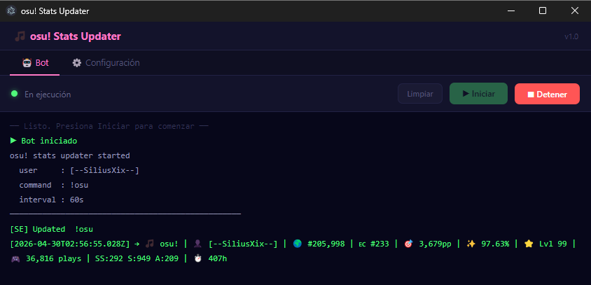
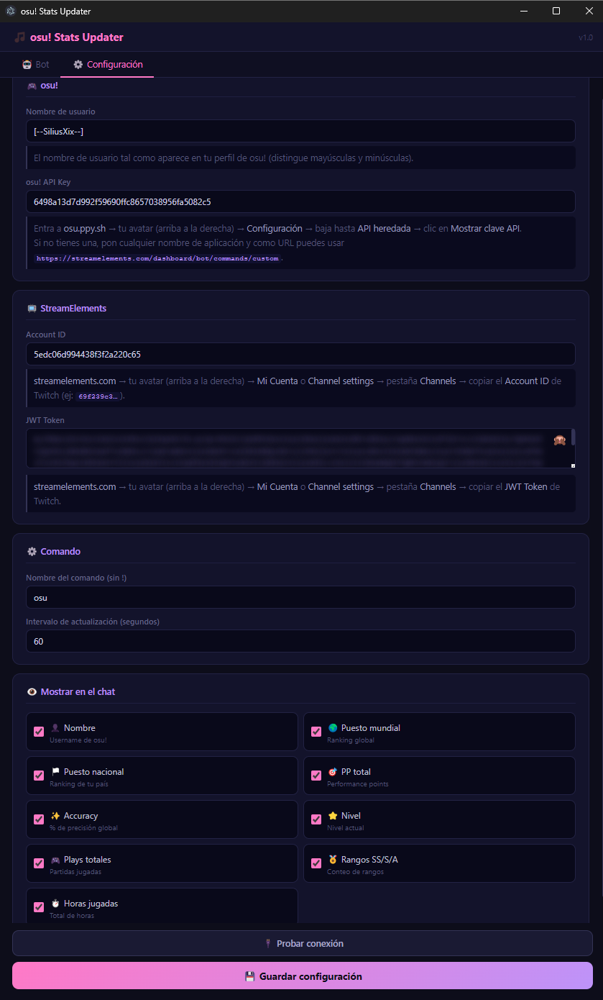
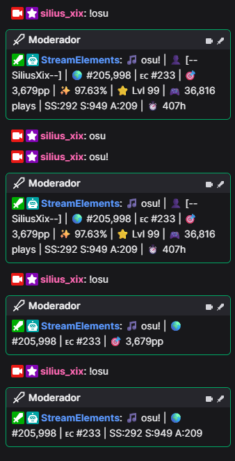

# osu! Stats Updater

Aplicación de escritorio que obtiene las estadísticas de osu! de un jugador y mantiene actualizado un comando de bot de StreamElements en tiempo real, de modo que los espectadores en el chat de Twitch puedan consultar las estadísticas actuales del streamer escribiendo un solo comando.

---

## Capturas de pantalla

| Bot en ejecución | Configuración |
|---|---|
|  |  |

**Resultado en el chat de Twitch:**



---

## Características

- Lee estadísticas en vivo desde la **osu! API v1**: ranking global, ranking por país, PP, accuracy, nivel, número de plays, conteo de rangos (SS / S / A) y horas jugadas.
- Actualiza (o crea) un comando personalizado de **StreamElements** automáticamente en cada ciclo de actualización.
- Toda la configuración — incluyendo qué estadísticas son visibles en el chat — se gestiona desde una **interfaz de escritorio integrada** (sin necesidad de navegador).
- Preserva la configuración existente del comando de StreamElements (palabras clave, cooldowns, alias) al actualizar el texto de respuesta.
- Las credenciales se almacenan **únicamente de forma local** y nunca se suben al control de versiones.

---

## Requisitos

| Dependencia | Versión |
|---|---|
| [Node.js](https://nodejs.org/) | 18 o superior |
| npm | Incluido con Node.js |

---

## Configuración inicial

### 1. Clonar el repositorio

```bash
git clone https://github.com/SiliusJM/osu-stats-updater.git
cd osu-stats-updater
```

### 2. Instalar dependencias

```bash
npm install
```

### 3. Obtener las credenciales

#### osu! API Key

1. Iniciar sesión en [osu.ppy.sh](https://osu.ppy.sh).
2. Hacer clic en el avatar (arriba a la derecha) → **Configuración**.
3. Bajar hasta la sección **API heredada** → clic en **Mostrar clave API**.
4. Si aún no se tiene una clave, registrar una nueva aplicación con cualquier nombre y usar `https://streamelements.com/dashboard/bot/commands/custom` como URL.

#### StreamElements — Account ID y JWT Token

1. Iniciar sesión en [StreamElements](https://streamelements.com).
2. Hacer clic en el avatar (arriba a la derecha) → **Mi Cuenta** o **Channel settings**.
3. Abrir la pestaña **Channels**.
4. Copiar el **Account ID** de Twitch (ejemplo: `5edc06d994438f3f2a220c65`).
5. Copiar el **JWT Token** de Twitch desde la misma pantalla.

### 4. Configurar la aplicación

Al iniciar la aplicación, ir a la pestaña **⚙️ Configuración**, rellenar todos los campos y hacer clic en **Guardar configuración**.

---

## Ejecución

**Windows (recomendado — sin ventana de terminal):**

```
Doble clic en  run.vbs
```

**Windows (con salida de terminal para depuración):**

```
Doble clic en  run.bat
```

**Inicio manual:**

```bash
npm start
```

En el primer inicio, si `node_modules` no existe, el lanzador instalará las dependencias automáticamente antes de abrir la aplicación.

---

## Interfaz

### Pestaña Bot

- Botón **▶ Iniciar** — arranca el bot y muestra el log en tiempo real.
- Botón **■ Detener** — detiene el bot.
- Botón **Limpiar** — limpia la consola de log.
- Al guardar la configuración mientras el bot está en ejecución, se reinicia automáticamente con los nuevos ajustes.

### Pestaña Configuración

| Campo | Descripción |
|---|---|
| **Nombre de usuario** | El username exacto del perfil de osu! |
| **osu! API Key** | Clave de API heredada de `osu.ppy.sh` |
| **Account ID** | ID de cuenta / canal mostrado en los ajustes de SE |
| **JWT Token** | Token JWT de los ajustes de cuenta de SE |
| **Nombre del comando** | Palabra activadora del comando en el chat (sin `!`) |
| **Intervalo de actualización** | Cada cuántos segundos se consultan las estadísticas |

Botón **🔌 Probar conexión** — verifica que las credenciales de osu! y StreamElements sean correctas antes de iniciar el bot.

### Estadísticas configurables

Cada estadística puede activarse o desactivarse de forma independiente desde la sección **Mostrar en el chat**:

| Toggle | Ejemplo en el chat |
|---|---|
| 👤 Nombre | `👤 SiliusJM` |
| 🌍 Puesto mundial | `🌍 #205,998` |
| 🏳️ Puesto nacional | `🇲🇽 #233` |
| 🎯 PP total | `🎯 3,679pp` |
| ✨ Accuracy | `✨ 97.63%` |
| ⭐ Nivel | `⭐ Lvl 100` |
| 🎮 Plays totales | `🎮 12,345 plays` |
| 🏅 Rangos SS/S/A | `SS:12 S:81 A:230` |
| ⏱️ Horas jugadas | `⏱️ 1,823h` |

> Los cambios en la configuración toman efecto inmediatamente al guardar.

---

## Ejemplo de resultado en el chat

```
🎵 osu! | 👤 SiliusJM | 🌍 #205,998 | 🇲🇽 #233 | 🎯 3,679pp | ✨ 97.63%
```

---

## Seguridad

- `config.json` está listado en `.gitignore` y nunca se subirá a un repositorio público.
- Se incluye `config.example.json` con valores de ejemplo vacíos como referencia.
- Las credenciales se almacenan solo en la máquina local y nunca se transmiten a ningún destino que no sea la API oficial de osu! y la API de StreamElements.

---

## Estructura del proyecto

```
osu-stats-updater/
├── main.js                        # Proceso principal de Electron
├── preload.js                     # Puente IPC seguro
├── gui.html                       # Interfaz de escritorio
├── index.js                       # Lógica del bot (osu! API + StreamElements)
├── config.json                    # Credenciales locales (excluido de git)
├── config.example.json            # Plantilla de configuración sin datos
├── run.vbs                        # Lanzador silencioso (sin ventana de terminal)
├── run.bat                        # Lanzador alternativo
├── assets/
│   └── screenshots/               # Capturas de pantalla para el README
└── package.json
```

---

## Licencia

MIT
